# HydroSense

**Understand Your Water. Protect Your Ecosystem.**

A citizen-friendly smart water monitoring platform that combines a low-cost ESP32 TDS sensor with citizen observations, transparent analytics and explainable assessment. Built for the **OneAquaHealth IEEE Hackathon**.

## Live Demo

**[Launch HydroSense](https://hydrosense-beta.vercel.app)** · [API documentation](https://hydrosense-beta.vercel.app/docs) · [Android APK](https://github.com/ANMOLSCRIPT/hydrosense/releases/latest)

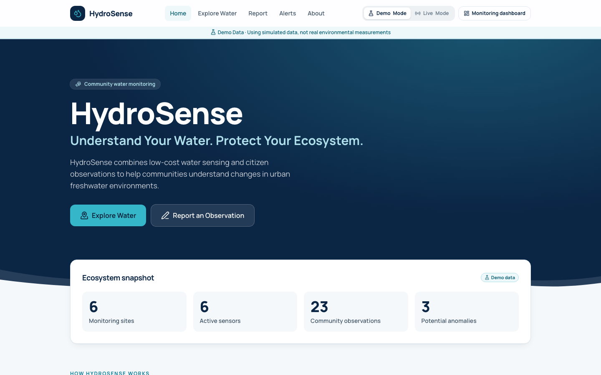

*The public site runs in Demo Mode by default. Screenshots in this README show simulated demo data, labelled as such in the app.*

> **Important:** HydroSense is an environmental monitoring and decision-support prototype. TDS is only one indicator and cannot by itself determine overall water quality, pollution, ecosystem health, or drinking-water safety. HydroSense alerts indicate changes that may warrant further observation or field verification.

## Overview

HydroSense turns continuous sensor readings and what people see at the water's edge into plain-language information: is this place behaving as it usually does, and if not, what changed and what should happen next.

**Sense → Share → Analyze → Understand → Act**

## Problem

Urban freshwater bodies change quickly and are monitored rarely. Laboratory sampling is accurate but infrequent and expensive, sensor dashboards are built for specialists, and the people who visit these places every day have no simple way to contribute what they notice or to understand what the data means.

## Solution

- A low-cost sensor node measures TDS continuously and reports over Wi-Fi.
- Citizens add structured observations in under a minute, with an optional photo.
- Each site is compared with its own history to detect sustained changes.
- A deterministic, explainable engine combines both sources into an assessment with a confidence level and a recommended next step.
- A citizen interface says it in plain language; a monitoring dashboard shows the detail.

## Key Features

- **Citizen experience:** home, interactive map, site pages, 8-step reporting flow, alerts, about and methodology.
- **Monitoring dashboard:** network overview, site analytics, AI insights, device monitoring, hardware test page, alert management.
- **Progressive disclosure:** "Something has changed" → *Why?* → *Show data*.
- **Anomaly detection** that requires persistence, so a single noisy reading never raises an alert.
- **Demo Mode and Live Mode** with an obvious toggle; demo data is always labelled.
- **Resilient firmware:** outlier filtering, smoothing, offline buffering, retry with backoff.
- **Accessible:** states use colour, icon and text; keyboard navigation; visible focus; reduced-motion support.

## System Architecture

```text
ESP32 + TDS probe ──HTTPS──▶ FastAPI on Vercel ──▶ Supabase (PostgreSQL + Storage)
                                   ▲    │
        React SPA on Vercel ───────┘    └─ analytics → anomaly detection → assessment
```

Details: [docs/ARCHITECTURE.md](docs/ARCHITECTURE.md)

## Technology Stack

| Layer | Technology |
|---|---|
| Web app | React 19, TypeScript, Vite, Tailwind CSS 4, TanStack Query, Recharts, Leaflet with OpenStreetMap |
| Android app | Kotlin, Jetpack Compose, Material 3, Retrofit, kotlinx.serialization, Coil, osmdroid |
| Backend | Python, FastAPI |
| Data | Supabase (PostgreSQL, Storage, Row Level Security) |
| Firmware | ESP32, Arduino C++, PlatformIO |
| Hosting | Vercel (static frontend and Python API in one project) |

## Data Flow

```text
WATER → TDS SENSOR → ESP32 → Wi-Fi → HYDROSENSE API → SUPABASE → ANALYTICS
      → AI-ASSISTED ASSESSMENT → CITIZEN-FRIENDLY INTERFACE → INSIGHTS + MAP + ALERTS
```

## UX Design Philosophy

A citizen should be able to use HydroSense without knowing anything about TDS, IoT or statistics.

- **Simple by default, detailed on demand.** Headline first, explanation one tap away, numbers one tap further.
- **Plain language.** "Recent readings are higher than what we usually observe here", not "z-score 2.87".
- **Two experiences, one product.** Citizens are never pushed into the technical dashboard.
- **Honest.** Potential anomaly, never confirmed pollution. Demo data is labelled everywhere.
- **Mobile first for reporting, desktop first for monitoring.**

## ESP32 / IoT Hardware

ESP32 development board and an analog TDS sensor module. Roughly USD 15 in parts.

### Wiring

```text
TDS sensor board        ESP32
VCC  (+)           →    3V3
GND  (−)           →    GND
A    (analog out)  →    GPIO 34
```

Power the sensor from 3V3 so its output can never exceed what the ESP32 tolerates. If your module needs 5 V or its specification is unknown, read [docs/HARDWARE.md](docs/HARDWARE.md) first.

### Firmware

```bash
cd firmware/hydrosense && cp config.example.h config.h   # then edit Wi-Fi, API_URL, IDs
cd .. && pio run -t upload && pio device monitor
```

Arduino IDE instructions, expected serial output and failure behaviour: [docs/HARDWARE.md](docs/HARDWARE.md). Calibration: [docs/CALIBRATION.md](docs/CALIBRATION.md).

## Supabase

Tables: `sites`, `devices`, `measurements`, `observations`, `alerts`, `assessments`. Photos go to the `observation-photos` Storage bucket. Row Level Security allows public read only; all writes go through the API with the server-side service-role key. Schema: [supabase/migrations/0001_hydrosense_schema.sql](supabase/migrations/0001_hydrosense_schema.sql). Setup: [docs/SUPABASE.md](docs/SUPABASE.md).

## Backend

FastAPI (Python). `backend/app/`: `main.py` (routes and validation), `service.py` (application logic), `analytics.py`, `assessment.py`, `llm.py`, `store.py`, `demo.py`.

## Web Application

React 19, TypeScript, Vite, Tailwind CSS 4, TanStack Query, Recharts, Leaflet with OpenStreetMap. `frontend/src/pages/` holds the citizen pages and `pages/dashboard/` the monitoring views.

### Dashboard

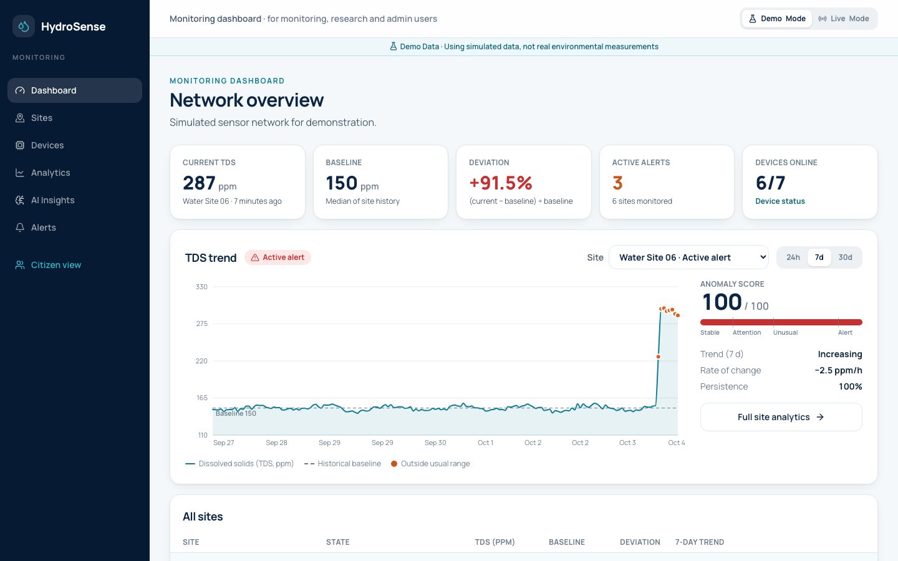

**Monitoring dashboard:** network overview with the latest reading, baseline, deviation, open alerts and device status.

### Live Monitoring

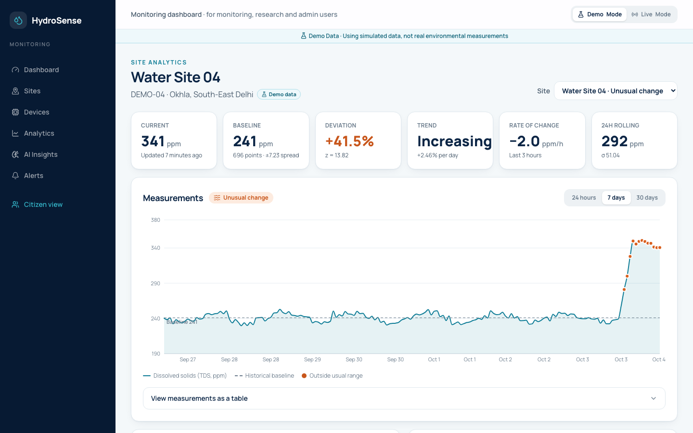

**Site analytics:** measurements against the site's own baseline, with points outside the usual range marked.

### Map

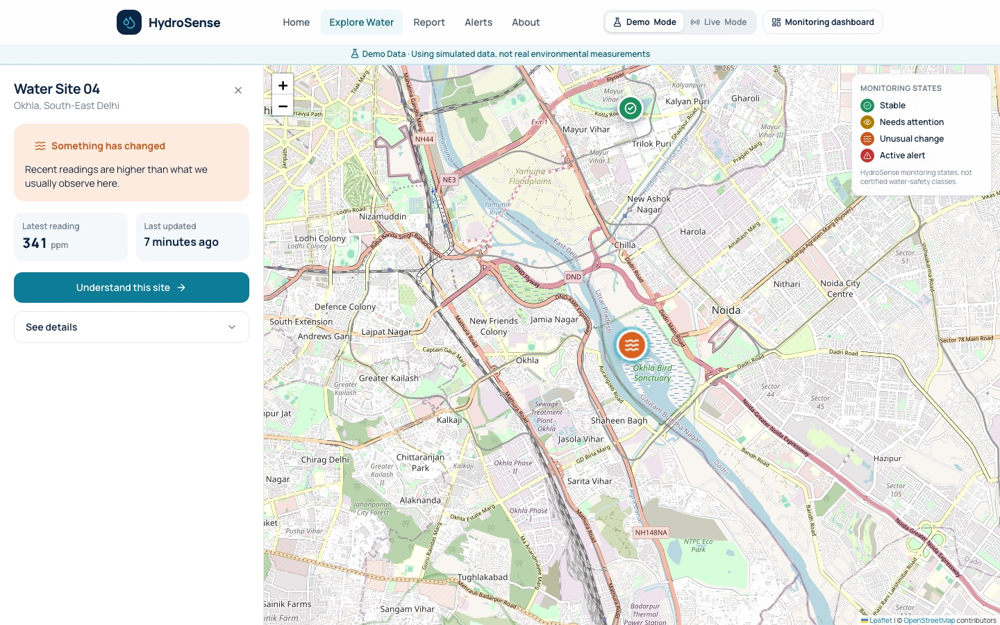

**Water map:** every monitoring site with its current state. States are HydroSense monitoring states, not certified water-safety classes.

### Site Details

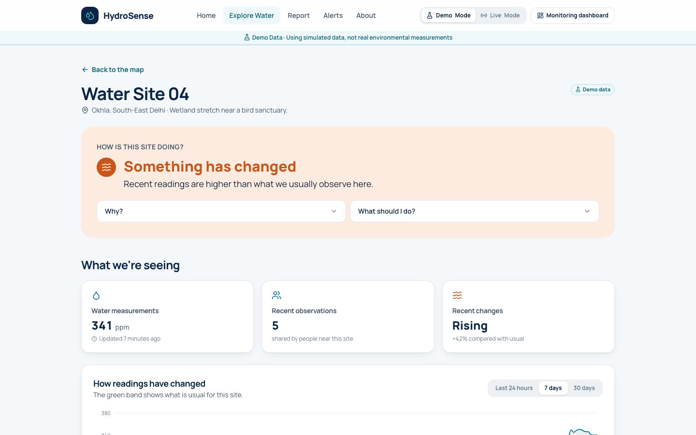

**Site page:** a plain-language headline first, with *Why?* and *What should I do?* one tap away.

### Citizen Reporting

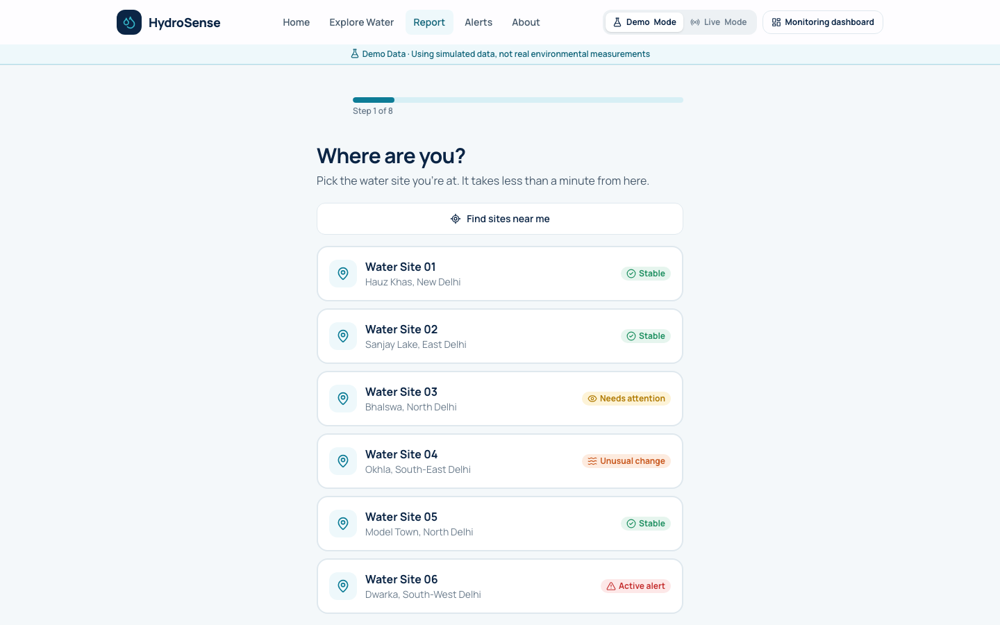

**Reporting flow:** pick a site, answer a few questions, optionally add a photo. No account needed.

### Alerts & Assessment

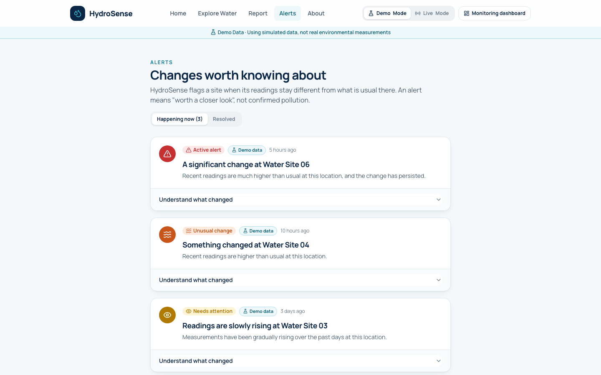

**Alerts:** raised only for sustained changes, and worded as worth a closer look, not confirmed pollution.

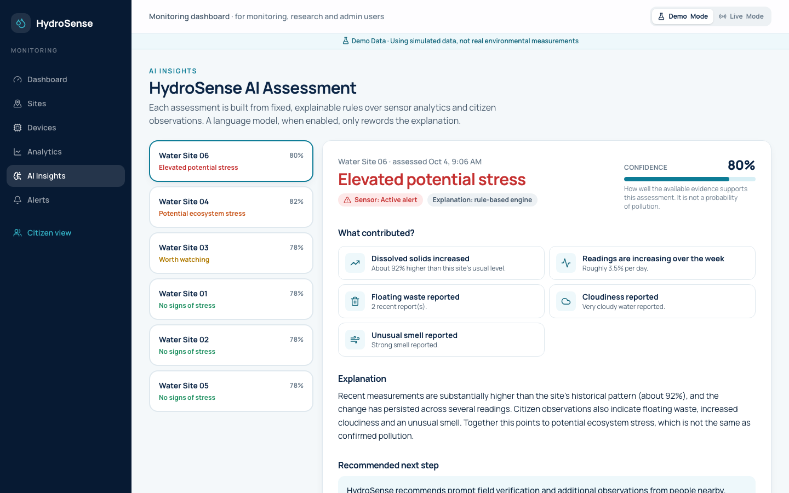

**Assessment:** rule-based evidence from sensor analytics and citizen observations, with a confidence level and a recommended next step.

### Routes

| Citizen | Monitoring |
|---|---|
| `/` Home | `/dashboard` Overview |
| `/explore` Map | `/dashboard/sites`, `/dashboard/sites/:id` |
| `/explore/:siteId` Site | `/dashboard/analytics` |
| `/report` Report | `/dashboard/insights` |
| `/alerts` Alerts | `/dashboard/devices`, `/dashboard/devices/test` |
| `/about` About | `/dashboard/alerts` |

## Android Application

A native Kotlin + Jetpack Compose client in [`android/`](android/README.md) that uses the same API, database and storage as the web app. Citizens can explore the map, open a site, read analytics, submit an observation with a photo and see alerts. Reports made on Android appear on the web, and sensor readings appear in both.

Download the APK from the [latest release](https://github.com/ANMOLSCRIPT/hydrosense/releases/latest).

| Mobile Dashboard | Map | Site |
|:---:|:---:|:---:|
| 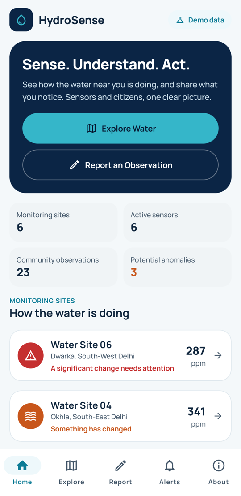 | 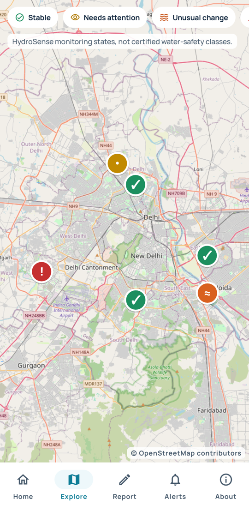 | 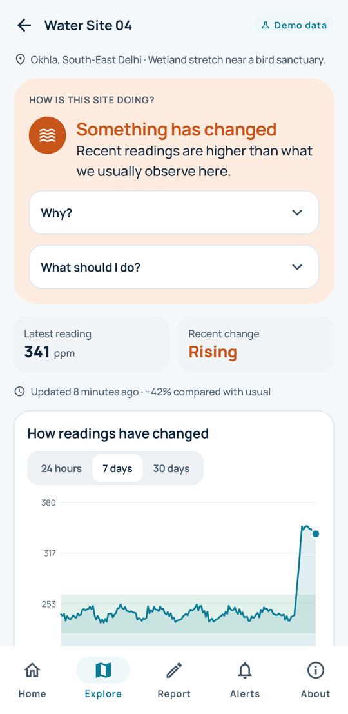 |
| **Monitoring** | **Reporting** | **Alerts** |
| 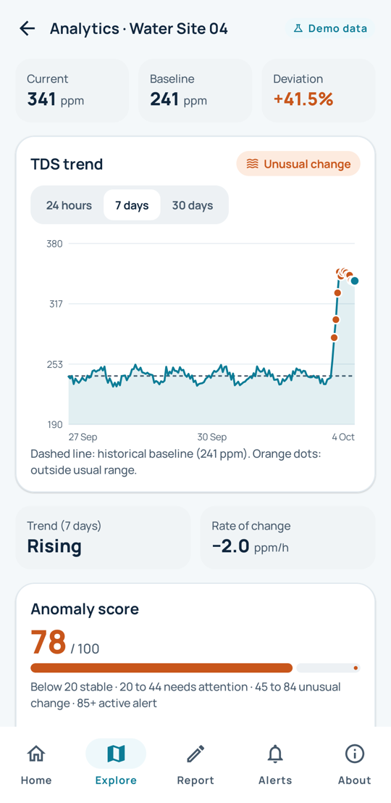 | 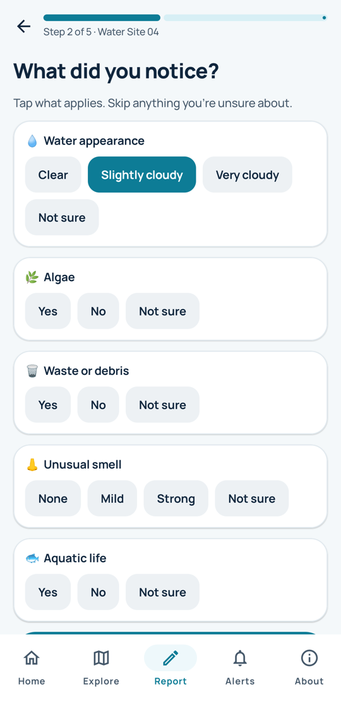 | 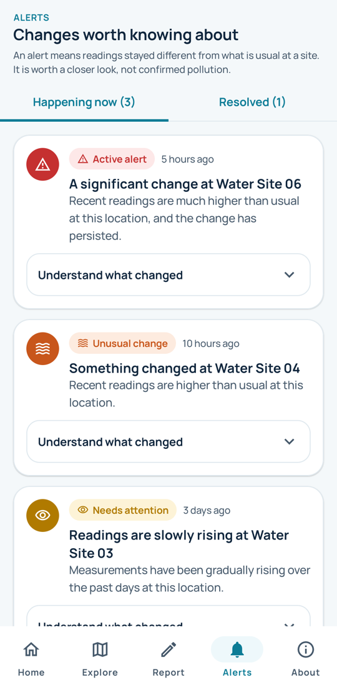 |

## AI Assessment

A deterministic evidence engine produces `assessment`, `confidence`, `contributing_factors`, `explanation` and `recommendation` from sensor analytics and the last 72 hours of citizen observations. If `ANTHROPIC_API_KEY` is configured, a Claude model rewrites the explanation from the same structured evidence; it cannot change results or introduce measurements. HydroSense works fully without an LLM.

## Anomaly Detection

Rolling statistics, a robust historical baseline, rate of change and persistence feed a transparent 0 to 100 score. Full definition, thresholds and caveats: [docs/METHODOLOGY.md](docs/METHODOLOGY.md).

## Demo Mode

Six simulated sites with 30 days of hourly data: two stable, one gradually rising, one potential anomaly, one recovered after an anomaly, one active alert. Alerts and assessments are produced by replaying that data through the real engines. Everything is flagged and labelled **Demo Data**.

## Live Hardware Mode

Switch the toggle to **Live Mode**. Readings posted by the ESP32 to `SITE-001` appear within seconds; the dashboard polls every 6 seconds. A new sensor shows "Still learning" until it has about 20 readings.

## Installation

```bash
# Backend (runs with built-in demo data if no Supabase credentials are set)
python3 -m venv .venv && .venv/bin/pip install -r backend/requirements-dev.txt
cp .env.example .env
.venv/bin/uvicorn backend.app.main:app --reload --port 8000     # http://localhost:8000/docs

# Frontend (proxies /api to port 8000)
cd frontend && npm install && npm run dev                        # http://localhost:5173

# Tests
.venv/bin/python -m pytest backend/tests -q

# Simulate the ESP32
.venv/bin/python scripts/simulate_device.py --api http://localhost:8000 --count 60 --interval 1 --spike-after 40
```

## Deployment

One Vercel project serves the static frontend and the FastAPI backend. The deployed application is at https://hydrosense-beta.vercel.app. See [docs/DEPLOYMENT.md](docs/DEPLOYMENT.md).

## Environment Variables

Copy `.env.example` to `.env` and fill in your own values. Only variable names are documented here.

| Variable | Scope | Purpose |
|---|---|---|
| `VITE_SUPABASE_URL` | browser | Supabase project URL |
| `VITE_SUPABASE_ANON_KEY` | browser | photo uploads |
| `VITE_API_URL` | browser | empty when the API is on the same origin |
| `SUPABASE_URL` | server | Supabase project URL |
| `SUPABASE_SERVICE_ROLE_KEY` | server only | API writes |
| `DATABASE_URL` | scripts only, optional | direct Postgres URL for `scripts/apply_schema.py` |
| `CORS_ORIGINS` | server, optional | comma-separated allowed origins |
| `INGEST_API_KEY` | server, optional | require `X-Device-Key` from devices |
| `ANTHROPIC_API_KEY`, `LLM_MODEL` | server, optional | LLM-written explanations |

**Where each part reads its configuration**

| Part | File (not committed) | Template | Names |
|---|---|---|---|
| Web app | `.env` | `.env.example` | `VITE_SUPABASE_URL`, `VITE_SUPABASE_ANON_KEY`, `VITE_API_URL` |
| Backend | `.env` | `.env.example` | `SUPABASE_URL`, `SUPABASE_SERVICE_ROLE_KEY`, optional `INGEST_API_KEY`, `ANTHROPIC_API_KEY`, `LLM_MODEL`, `CORS_ORIGINS` |
| Android app | `android/hydrosense.properties` | `android/hydrosense.properties.example` | `API_BASE_URL`, `SUPABASE_URL`, `SUPABASE_ANON_KEY` (client-safe values only) |
| ESP32 firmware | `firmware/hydrosense/config.h` | `firmware/hydrosense/config.example.h` | `WIFI_SSID`, `WIFI_PASSWORD`, `API_URL`, `DEVICE_KEY`, `DEVICE_ID`, `SITE_ID` |
| Deployment | Vercel project environment variables | [docs/DEPLOYMENT.md](docs/DEPLOYMENT.md) | the web app and backend names above |

The Supabase anon (publishable) key is designed to be shipped in the browser and the Android app; Row Level Security limits it to public reads and photo uploads. The service-role key is server-only and must never be placed in the frontend, the Android app or the firmware.

Never commit `.env`, `android/hydrosense.properties`, `firmware/hydrosense/config.h`, or any key.

## API Documentation

Swagger UI at `/docs`. Summary: [docs/API.md](docs/API.md).

## Responsible Water-Quality Interpretation

HydroSense reports how a site's recent TDS readings compare with that site's own history, alongside what citizens observed. An alert means a sustained change that may deserve a closer look. It is worded as a potential anomaly, never as confirmed pollution, and it is not a statement about whether water is safe.

## Limitations

- TDS is one indicator. It does not detect pathogens, heavy metals, nutrients, pesticides or dissolved oxygen.
- Low-cost probes are not laboratory instruments; readings depend on calibration and temperature, which is assumed rather than measured.
- The anomaly score and assessment thresholds are transparent heuristics that have not been validated against field data.
- Citizen observations are subjective and unverified.
- HydroSense does not determine whether water is safe to drink, swim in or fish from.

## Hackathon Track Alignment

- **Primary, Track 6 (Resilience Informatics):** continuous sensing, change detection and actionable alerts for urban freshwater.
- Track 2 (Data-to-Insight): raw readings become baselines, trends and explanations.
- Track 3 (AI-Supported Assessment): explainable, evidence-based assessment with optional LLM wording.
- Track 1 (Citizen Science UX): one-minute reporting flow and plain-language site pages.

## Future Work

Temperature, pH, turbidity, dissolved oxygen and conductivity sensing · LoRaWAN · solar-powered nodes · additional environmental sensors · computer vision on citizen photos · FHIR interoperability · larger-scale deployment · authentication for the monitoring dashboard · validation of thresholds against laboratory data.

## Project Structure

```text
frontend/   React application          firmware/   ESP32 firmware
android/    Native Android app (Kotlin)
backend/    FastAPI application        docs/       architecture, methodology, hardware, API
api/        Vercel entry point         scripts/    seed, schema and device simulator
supabase/   database migrations
```

License: MIT
